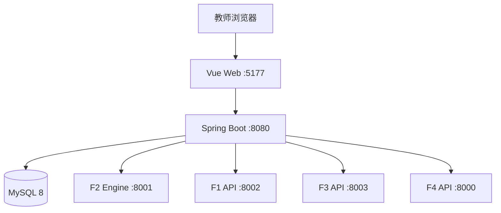

# 备课搭子：教案设计多智能体支持系统

本仓库把四个教学智能体整合到统一 Vue Web 中：

- F1 智能评价：教案评分、批注、批量评价与对比；
- F2 设计修改：教案生成、优化、教师复核与版本保存；
- F3 课堂推演：多角色动态课堂模拟、问题分析与行动建议；
- F4 协同共析：分节建议、人机决策、修订与写回；
- 统一教案空间：使用同一 `lessonId/versionId` 管理 DOCX、版本及跨模块结果；
- 公共问题池：汇聚 F1/F3/F4 问题，并向 F2/F4 提供上下文。

## 系统结构



所有后端服务默认只监听 `127.0.0.1`。服务器公网部署时应由 Nginx 提供 HTTPS、静态页面及 `/api/` 反向代理，不要把 8000–8003、8080 直接暴露到公网。

## 目录

```text
LessonAgentPlatform-Release/
├─ Lessongen-main/             # F2、Spring Boot、Vue 和总平台桥接层
├─ System-v1.2/                # F1 智能评价 API
├─ SimClass-main/              # F3 完整课堂模拟 API
├─ NoviceTeacher-AI-main/      # F4 协同共析 API
├─ scripts/                    # 启动、停止和健康检查
├─ docs/                       # Windows/Linux 安装说明
├─ deploy/nginx/               # Linux Nginx 示例
├─ .env.example                # 无密钥配置模板
└─ .gitignore
```

## 端口和健康检查

| 服务 | 端口 | 健康地址 |
|---|---:|---|
| F4 协同共析 | 8000 | `http://127.0.0.1:8000/api/health` |
| F2 Python Engine | 8001 | `http://127.0.0.1:8001/internal/v1/health` |
| F1 智能评价 | 8002 | `http://127.0.0.1:8002/internal/v1/health` |
| F3 课堂推演 | 8003 | `http://127.0.0.1:8003/api/health` |
| F2 Spring Boot | 8080 | `http://127.0.0.1:8080/actuator/health` |
| Vue 前端（本地） | 5177 | `http://127.0.0.1:5177/` |

## 环境要求

- Python 3.11 或 3.12；
- Java 17 或更高版本；
- Node.js 20/22 LTS（Node 24 已在现有开发机验证）；
- MySQL 8；
- Git；
- Windows PowerShell 5.1+，或 Linux Bash、curl、Nginx。

本项目不依赖 Docker。

## 第一次安装

1. 阅读 [Windows 安装说明](docs/INSTALL_WINDOWS.md) 或 [Linux 安装说明](docs/INSTALL_LINUX.md)。
2. 复制 `.env.example` 为 `.env`，填写模型密钥、MySQL 用户和密码。
3. 创建 MySQL 数据库 `lesoongen`。
4. 为 F1、F2 Engine、F3、F4 分别建立独立虚拟环境并安装依赖。
5. 执行 Maven 测试和 Vue 构建。
6. 使用 `scripts/start-all.ps1` 或 `scripts/start-all.sh` 启动。

## Windows 快速启动

完成首次安装后，在项目根目录执行：

```powershell
powershell -NoProfile -ExecutionPolicy Bypass -File .\scripts\start-all.ps1
```

检查状态：

```powershell
powershell -NoProfile -ExecutionPolicy Bypass -File .\scripts\health-check.ps1
```

停止：

```powershell
powershell -NoProfile -ExecutionPolicy Bypass -File .\scripts\stop-all.ps1
```

日志位于：

```text
.runtime/logs/
```

## Linux 快速启动

完成首次安装后：

```bash
chmod +x scripts/*.sh Lessongen-main/web/mvnw
./scripts/start-all.sh
./scripts/health-check.sh
./scripts/stop-all.sh
```

正式服务器建议先构建 Vue，再让 Nginx 服务 `web/frontend/dist`；此时使用：

```bash
./scripts/start-all.sh --skip-frontend
```

Nginx 示例见 `deploy/nginx/lesson-agent.conf.example`。

## 配置规则

- 真实密钥只能写入根目录 `.env`，不能写入 `.env.example`、源码或 Git；
- `ENGINE_INTERNAL_TOKEN` 必须同时提供给 F2 Engine 与 Spring Boot；统一启动脚本会从根 `.env` 注入；
- F1/F2 使用 `DEEPSEEK_API_KEY`；F3 使用 `API_KEY`；F4 使用 `LLM_API_KEY`。三者通常填写同一 DeepSeek 密钥；
- 服务器域名部署时，把 `FRONTEND_ORIGIN` 改为真实访问源，例如 `https://lesson.example.com`；
- F4 默认使用自己的 SQLite 文件，平台教案、版本、任务和公共问题保存在 MySQL 中。

## 数据位置

| 数据 | 默认位置 |
|---|---|
| 平台教案、版本、任务、公共问题 | MySQL `lesoongen` |
| 上传的原始 DOCX/平台制品 | `Lessongen-main/web/var/storage` |
| F2 Engine 状态与制品 | `Lessongen-main/paper4_pipeline/var` |
| F3 Session/Event/Result | `SimClass-main/runtime/f3_sessions` |
| F4 会话数据库 | `NoviceTeacher-AI-main/backend/pedago_loop.db` |
| F1 运行结果 | `System-v1.2/platform_runs` 等目录 |

生产环境必须定期备份 MySQL、`web/var/storage`、F3 runtime 和 F4 SQLite。

## 发布前验收

```powershell
# Java
cd Lessongen-main\web
.\mvnw.cmd test
.\mvnw.cmd clean package

# Vue
cd frontend
npm ci
npm run build
```

还需确认：

- `python -c "import platform_api"` 能在 F1 虚拟环境中通过；
- 五个后端健康接口均返回正常；
- 用一份脱敏 DOCX 完成导入、评价、优化、推演、共析与版本下载；
- 正式运行显示 REAL 模式，且仓库中没有 `.env`、`.api_key`、用户教案或数据库文件。

## 常见问题

- `ECONNREFUSED 127.0.0.1:8080`：Spring Boot 未启动或端口被占用；
- F1 HTTP 422：教案的学科、年级或课题为空；
- F3 显示 MOCK：未设置 `API_KEY` 或 `F3_MODEL_MODE` 不是 `REAL`；
- F4 无法生成建议：检查 `LLM_API_KEY`、额度和 `LLM_BASE_URL`；
- Flyway 报重复版本：不要同时放入两份同版本 migration；保持当前 MySQL/H2 分目录结构；
- PowerShell 禁止脚本：使用命令中的 `-ExecutionPolicy Bypass`，不要全局降低执行策略。

## 安全说明

本项目处理教案和模型输出。部署者应使用脱敏教学材料、限制服务器访问权限、配置 HTTPS、控制日志内容并定期清理运行数据。模型建议仅作为教学设计参考，最终成果应由教师复核。

